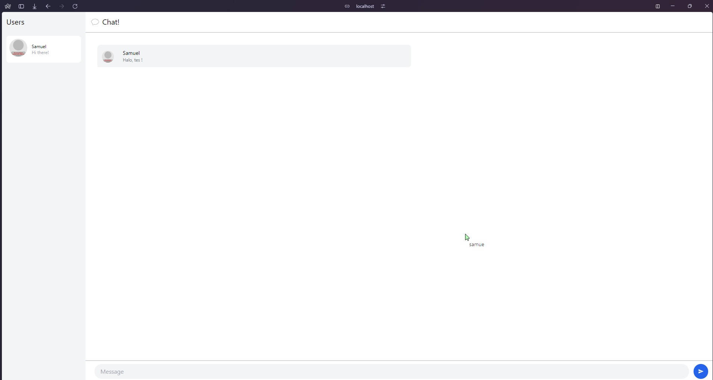

# Modul 10 - YewChat
**Samuel Farrel Bagasputra - 2206826614 - Adpro C**
  

## Experiment 3.1: Original code
### Terminal Run

### Browser Run
  

## Experiment 3.2: Be Creative!
  
**Explanation** - Untuk kreatifitas, saya mengubah tema dari aplikasi chat menjadi berwarna biru. Styling saya lakukan dengan merubah html yang direturn pada file `chat.rs` menggunakan tailwind. 